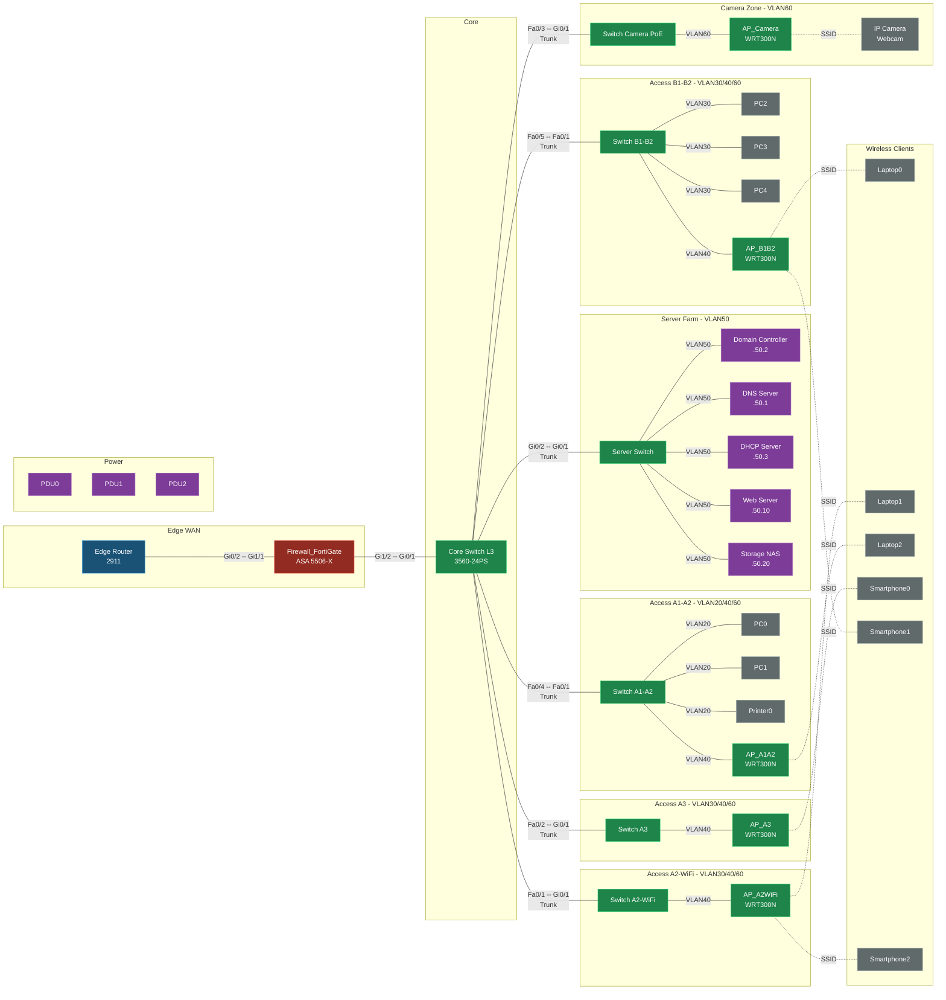

```mermaid

flowchart LR
    subgraph EdgeWAN["Edge WAN"]
        edge_rtr["Edge Router<br/>2911"]:::router
        fw1["Firewall_FortiGate<br/>ASA 5506-X"]:::firewall
    end
    subgraph Core["Core"]
        core_l3["Core Switch L3<br/>3560-24PS"]:::switch
    end
    subgraph ServerFarm["Server Farm - VLAN50"]
        sw_srv["Server Switch"]:::switch
        dc1["Domain Controller<br/>.50.2"]:::server
        dns1["DNS Server<br/>.50.1"]:::server
        dhcp1["DHCP Server<br/>.50.3"]:::server
        web1["Web Server<br/>.50.10"]:::server
        nas1["Storage NAS<br/>.50.20"]:::server
    end
    subgraph AccessA1A2["Access A1-A2 - VLAN20/40/60"]
        sw_a1a2["Switch A1-A2"]:::switch
        pc0["PC0"]:::host
        pc1["PC1"]:::host
        printer0["Printer0"]:::host
        ap_a1a2["AP_A1A2<br/>WRT300N"]:::switch
    end
    subgraph AccessA2WiFi["Access A2-WiFi - VLAN30/40/60"]
        sw_a2wifi["Switch A2-WiFi"]:::switch
        ap_a2wifi["AP_A2WiFi<br/>WRT300N"]:::switch
    end
    subgraph AccessB1B2["Access B1-B2 - VLAN30/40/60"]
        sw_b1b2["Switch B1-B2"]:::switch
        pc2["PC2"]:::host
        pc3["PC3"]:::host
        pc4["PC4"]:::host
        ap_b1b2["AP_B1B2<br/>WRT300N"]:::switch
    end
    subgraph AccessA3["Access A3 - VLAN30/40/60"]
        sw_a3["Switch A3"]:::switch
        ap_a3["AP_A3<br/>WRT300N"]:::switch
    end
    subgraph CameraZone["Camera Zone - VLAN60"]
        sw_cam["Switch Camera PoE"]:::switch
        ap_cam["AP_Camera<br/>WRT300N"]:::switch
        ipcam["IP Camera<br/>Webcam"]:::host
    end
    subgraph Wireless["Wireless Clients"]
        lap0["Laptop0"]:::host
        lap1["Laptop1"]:::host
        lap2["Laptop2"]:::host
        phone0["Smartphone0"]:::host
        phone1["Smartphone1"]:::host
        phone2["Smartphone2"]:::host
    end
    subgraph Power["Power"]
        pdu0["PDU0"]:::server
        pdu1["PDU1"]:::server
        pdu2["PDU2"]:::server
    end

    edge_rtr ---|"Gi0/2 -- Gi1/1"| fw1
    fw1 ---|"Gi1/2 -- Gi0/1"| core_l3
    core_l3 ---|"Gi0/2 -- Gi0/1<br/>Trunk"| sw_srv
    core_l3 ---|"Fa0/1 -- Gi0/1<br/>Trunk"| sw_a2wifi
    core_l3 ---|"Fa0/2 -- Gi0/1<br/>Trunk"| sw_a3
    core_l3 ---|"Fa0/3 -- Gi0/1<br/>Trunk"| sw_cam
    core_l3 ---|"Fa0/4 -- Fa0/1<br/>Trunk"| sw_a1a2
    core_l3 ---|"Fa0/5 -- Fa0/1<br/>Trunk"| sw_b1b2
    sw_srv ---|"VLAN50"| dc1
    sw_srv ---|"VLAN50"| dns1
    sw_srv ---|"VLAN50"| dhcp1
    sw_srv ---|"VLAN50"| web1
    sw_srv ---|"VLAN50"| nas1
    sw_a1a2 ---|"VLAN20"| pc0
    sw_a1a2 ---|"VLAN20"| pc1
    sw_a1a2 ---|"VLAN20"| printer0
    sw_a1a2 ---|"VLAN40"| ap_a1a2
    sw_a2wifi ---|"VLAN40"| ap_a2wifi
    sw_b1b2 ---|"VLAN30"| pc2
    sw_b1b2 ---|"VLAN30"| pc3
    sw_b1b2 ---|"VLAN30"| pc4
    sw_b1b2 ---|"VLAN40"| ap_b1b2
    sw_a3 ---|"VLAN40"| ap_a3
    sw_cam ---|"VLAN60"| ap_cam
    ap_a1a2 -.-|"SSID"| lap2
    ap_b1b2 -.-|"SSID"| lap0
    ap_a2wifi -.-|"SSID"| lap1
    ap_a3 -.-|"SSID"| phone0
    ap_b1b2 -.-|"SSID"| phone1
    ap_a2wifi -.-|"SSID"| phone2
    ap_cam -.-|"SSID"| ipcam

    classDef router fill:#1a5276,stroke:#3498db,color:#fff
    classDef switch fill:#1e8449,stroke:#2ecc71,color:#fff
    classDef firewall fill:#922b21,stroke:#e74c3c,color:#fff
    classDef server fill:#7d3c98,stroke:#a569bd,color:#fff
    classDef host fill:#616a6b,stroke:#95a5a6,color:#fff

```